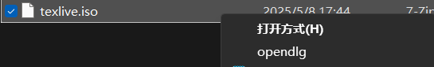
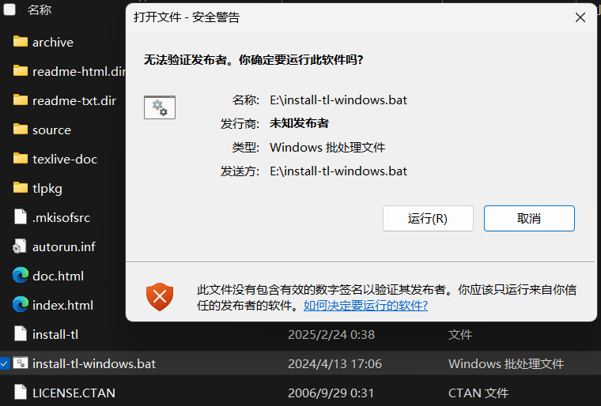
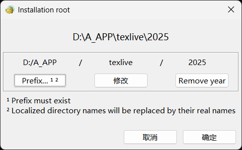
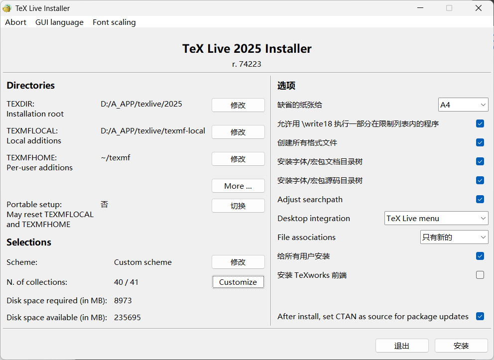

## VIM

### 常见命令

##### 退出命令

按 ESC 键 跳到命令模式，然后输入: q（不保存）或者: wq（保存） 退出。
: w 保存文件但不退出 vi
: w file 将修改另外保存到 file 中，不退出 vi
: w! 强制保存，不推出 vi
: wq 保存文件并退出 vi
: wq! 强制保存文件，并退出 vi
: q 不保存文件，退出 vi
: q! 不保存文件，强制退出 vi
: e! 放弃所有修改，从上次保存文件开始再编辑命令历史

以: 和/开头的命令都有历史纪录，可以首先键入: 或/然后按上下箭头来选择某个历史命令。

##### 启动 vim

在命令行窗口中输入以下命令即可

vim 直接启动 vim

vim filename 打开 vim 并创建名为 filename 的文件

##### 文件命令

打开单个文件

vim file

同时打开多个文件

vim file1 file2 file3 …

在 vim 窗口中打开一个新文件

: open file

在新窗口中打开文件

: split file

切换到下一个文件

: bn

切换到上一个文件

: bp

查看当前打开的文件列表，当前正在编辑的文件会用 [] 括起来。

: args

打开远程文件，比如 ftp 或者 share folder

: e ftp://192.168.10.76/abc.txt

: e \qadrive\test\1.txt

##### vim 的模式

正常模式（按 Esc 或 Ctrl+[进入） 左下角显示文件名或为空
插入模式（按 i 键进入） 左下角显示–INSERT–
可视模式（不知道如何进入） 左下角显示–VISUAL–

##### 插入命令

i 在当前位置生前插入
I 在当前行首插入
a 在当前位置后插入
A 在当前行尾插入
o 在当前行之后插入一行
O 在当前行之前插入一行

##### 查找命令

/text　　查找 text，按 n 健查找下一个，按 N 健查找前一个。
?text　　查找 text，反向查找，按 n 健查找下一个，按 N 健查找前一个。

vim 中有一些特殊字符在查找时需要转义　　.*[]^%/?~$

: set ignorecase　　忽略大小写的查找
: set noignorecase　　不忽略大小写的查找

##### 查找很长的词

如果一个词很长，键入麻烦，可以将光标移动到该词上，按*或#键即可以该单词进行搜索，相当于/搜索。而#命令相当于?搜索。

: set hlsearch　　高亮搜索结果，所有结果都高亮显示，而不是只显示一个匹配。
: set nohlsearch　　关闭高亮搜索显示
: nohlsearch　　关闭当前的高亮显示，如果再次搜索或者按下 n 或 N 键，则会再次高亮。
: set incsearch　　逐步搜索模式，对当前键入的字符进行搜索而不必等待键入完成。
: set wrapscan　　重新搜索，在搜索到文件头或尾时，返回继续搜索，默认开启。

##### 替换命令

ra 将当前字符替换为 a，当期字符即光标所在字符。
s/old/new/ 用 old 替换 new，替换当前行的第一个匹配
s/old/new/g 用 old 替换 new，替换当前行的所有匹配
%s/old/new/ 用 old 替换 new，替换所有行的第一个匹配
%s/old/new/g 用 old 替换 new，替换整个文件的所有匹配
: 10,20 s/^/ /g 在第 10 行知第 20 行每行前面加四个空格，用于缩进。
ddp 交换光标所在行和其下紧邻的一行。

##### 移动命令

h 左移一个字符
l 右移一个字符，这个命令很少用，一般用 w 代替。
k 上移一个字符
j 下移一个字符

以上四个命令可以配合数字使用，比如 20j 就是向下移动 20 行，5h 就是向左移动 5 个字符，在 Vim 中，很多命令都可以配合数字使用，比如删除 10 个字符 10x，在当前位置后插入 3 个！，3a！，这里的 Esc 是必须的，否则命令不生效。

w 向前移动一个单词（光标停在单词首部），如果已到行尾，则转至下一行行首。此命令快，可以代替 l 命令。
b 向后移动一个单词 2b 向后移动 2 个单词
e，同 w，只不过是光标停在单词尾部
ge，同 b，光标停在单词尾部。
^ 移动到本行第一个非空白字符上。
0（数字 0）移动到本行第一个字符上，
移动到本行第一个字符。同 0 健。
移动到下面 3 行的行尾
gg 移动到文件头。 = [[
G（shift + g） 移动到文件尾。 = ]]
f（find）命令也可以用于移动，fx 将找到光标后第一个为 x 的字符，3fd 将找到第三个为 d 的字符。
F 同 f，反向查找。

跳到指定行，冒号+行号，回车，比如跳到 240 行就是 : 240 回车。另一个方法是行号+G，比如 230G 跳到 230 行。

Ctrl + e 向下滚动一行
Ctrl + y 向上滚动一行
Ctrl + d 向下滚动半屏
Ctrl + u 向上滚动半屏
Ctrl + f 向下滚动一屏
Ctrl + b 向上滚动一屏

##### 撤销和重做

u 撤销（Undo）
U 撤销对整行的操作
Ctrl + r 重做（Redo），即撤销的撤销。

##### 删除命令

x 删除当前字符
3x 删除当前光标开始向后三个字符
X 删除当前字符的前一个字符。X = dh
dl 删除当前字符， dl = x
dh 删除前一个字符
dd 删除当前行
dj 删除上一行
dk 删除下一行
10d 删除当前行开始的 10 行。
D 删除当前字符至行尾。D = d 删除当前字符之后的所有字符（本行）
kdgg 删除当前行之前所有行（不包括当前行）
jdG（jd shift + g） 删除当前行之后所有行（不包括当前行）
: 1,10d 删除 1-10 行
: 11, d 删除所有行
J(shift + j)　　删除两行之间的空行，实际上是合并两行。

##### 拷贝和粘贴

yy 拷贝当前行
nyy 拷贝当前后开始的 n 行，比如 2yy 拷贝当前行及其下一行。
p 在当前光标后粘贴, 如果之前使用了 yy 命令来复制一行，那么就在当前行的下一行粘贴。
shift+p 在当前行前粘贴
: 1,10 co 20 将 1-10 行插入到第 20 行之后。
: 1, 将整个文件复制一份并添加到文件尾部。

正常模式下按 v（逐字）或 V（逐行）进入可视模式，然后用 jklh 命令移动即可选择某些行或字符，再按 y 即可复制

ddp 交换当前行和其下一行
xp 交换当前字符和其后一个字符

##### 剪切命令

正常模式下按 v（逐字）或 V（逐行）进入可视模式，然后用 jklh 命令移动即可选择某些行或字符，再按 d 即可剪切

ndd 剪切当前行之后的 n 行。利用 p 命令可以对剪切的内容进行粘贴
: 1,10d 将 1-10 行剪切。利用 p 命令可将剪切后的内容进行粘贴。
: 1, 10 m 20 将第 1-10 行移动到第 20 行之后。

##### 退出命令

: wq 保存并退出
ZZ 保存并退出
: q! 强制退出并忽略所有更改
: e! 放弃所有修改，并打开原来文件。

##### 窗口命令

: split 或 new 打开一个新窗口，光标停在顶层的窗口上
: split file 或: new file 用新窗口打开文件
split 打开的窗口都是横向的，使用 vsplit 可以纵向打开窗口。
Ctrl+ww 移动到下一个窗口
Ctrl+wj 移动到下方的窗口
Ctrl+wk 移动到上方的窗口

##### 关闭窗口

: close 最后一个窗口不能使用此命令，可以防止意外退出 vim。
: q 如果是最后一个被关闭的窗口，那么将退出 vim。
ZZ 保存并退出。

关闭所有窗口，只保留当前窗口

: only

##### 录制宏

按 q 键加任意字母开始录制，再按 q 键结束录制（这意味着 vim 中的宏不可嵌套），使用的时候@加宏名，比如 qa。。。q 录制名为 a 的宏，@a 使用这个宏。

##### 执行 shell 命令

:! command
:! ls 列出当前目录下文件
:! perl -c script.pl 检查 perl 脚本语法，可以不用退出 vim，非常方便。
:! perl script.pl 执行 perl 脚本，可以不用退出 vim，非常方便。
: suspend 或 Ctrl - Z 挂起 vim，回到 shell，按 fg 可以返回 vim。

##### 注释命令

perl 程序中#开始的行为注释，所以要注释某些行，只需在行首加入#

3,5 s/^/#/g 注释第 3-5 行
3,5 s/^#//g 解除 3-5 行的注释
1,$ s/^/#/g 注释整个文档。
:%s/^/#/g 注释整个文档，此法更快。

##### 帮助命令

: help or F1 显示整个帮助
: help xxx 显示 xxx 的帮助，比如 : help i, : help CTRL-[（即 Ctrl+[的帮助）
: help ‘number’ Vim 选项的帮助用单引号括起
: help 特殊键的帮助用 <> 扩起
: help -t Vim 启动参数的帮助用-
：help i_ 插入模式下 Esc 的帮助，某个模式下的帮助用模式_主题的模式

帮助文件中位于||之间的内容是超链接，可以用 Ctrl+]进入链接，Ctrl+o（Ctrl + t）返回

##### 其他非编辑命令

. 重复前一次命令

: set ruler?　　查看是否设置了 ruler，在.vimrc 中，使用 set 命令设制的选项都可以通过这个命令查看
: scriptnames　　查看 vim 脚本文件的位置，比如.vimrc 文件，语法文件及 plugin 等。
: set list 显示非打印字符，如 tab，空格，行尾等。如果 tab 无法显示，请确定用 set lcs = tab:>-命令设置了.vimrc 文件，并确保你的文件中的确有 tab，如果开启了 expendtab，那么 tab 将被扩展为空格。

##### Vim 教程

###### 在 Unix 系统上

``` bash
$ vimtutor
```

###### 在 Windows 系统上

: help tutor

##### syntax

: syntax 列出已经定义的语法项
: syntax clear 清除已定义的语法规则
: syntax case match 大小写敏感，int 和 Int 将视为不同的语法元素
: syntax case ignore 大小写无关，int 和 Int 将视为相同的语法元素，并使用同样的配色方案


## Excel

#### 快捷键

1. 新建工作表

   shift + F11


## LaTex

#### texlive

##### installation

- download

  [Index of /CTAN/systems/texlive/Images/ | 清华大学开源软件镜像站 | Tsinghua Open Source Mirror](https://mirrors.tuna.tsinghua.edu.cn/CTAN/systems/texlive/Images/)

  选择 texlive.iso
  

  > 下载链接
  >
  > https://mirrors.tuna.tsinghua.edu.cn/CTAN/systems/texlive/Images/texlive.iso

- install

  1. 右键 iso, 在文件资源管理器中打开
     

  2. 右键以 管理员 身份运行 `install-tl-windows.bat`
     
     同意运行
     

  3. 稍后弹出 TeXLive Installer
     

  4. 修改安装地址
     

     修改后显示地址
     

  5. 本次安装的 Advance 设置如下
     

  6. 开始安装弹窗
     

     > 要一个多小时我也是服了

  7. cmd 查看安装版本
  
     ```powershell
     C:\Users\%username%>xelatex -v
     XeTeX 3.141592653-2.6-0.999997 (TeX Live 2025)
     kpathsea version 6.4.1
     Copyright 2025 SIL International, Jonathan Kew and Khaled Hosny.
     There is NO warranty.  Redistribution of this software is
     covered by the terms of both the XeTeX copyright and
     the Lesser GNU General Public License.
     For more information about these matters, see the file
     named COPYING and the XeTeX source.
     Primary author of XeTeX: Jonathan Kew.
     Compiled with ICU version 76.1; using 76.1
     Compiled with zlib version 1.3.1; using 1.3.1
     Compiled with FreeType2 version 2.13.3; using 2.13.3
     Compiled with Graphite2 version 1.3.14; using 1.3.14
     Compiled with HarfBuzz version 10.2.0; using 10.2.0
     Compiled with libpng version 1.6.46; using 1.6.46
     Compiled with pplib version v2.2
     Compiled with fontconfig version 2.15.0; using 2.15.0
     ```
  
  8. 


##### references

> [Visual Studio Code (vscode)配置 LaTeX - 知乎](https://zhuanlan.zhihu.com/p/166523064)

###### log

see in 03_Tools_log.txt


### Grammer

#### 1. 空格

##### 基础空格

| 命令   | 效果描述             | 示例代码  | 渲染效果 |
| :----- | :------------------- | :-------- | :------- |
| \      | 单个空格             | a\ b      | a b      |
| \,     | 小空格（约1/6个em）  | a\,b      | a b      |
| \;     | 中空格（约5/18个em） | a\;b      | a b      |
| \quad  | 等宽空格（1em）      | a\quad b  | a b      |
| \qquad | 双倍等宽空格（2em）  | a\qquad b | a  b     |

##### 弹性水平间距

`\hspace{}`命令支持自定义宽度，支持`em`、`cm`等单位：

```latex
a\hspace{1cm}b % 1厘米水平间距
```

> [LaTeX中空格与换行的精准控制方法](https://comate.baidu.com/zh/page/UpqYCmQvcg)


#### 2. 表格

##### 整体居中

有时文档为两列格式，需要将表格居于两列中间显示，可使用

```latex
\begin{table*}
\end{table*}
```

##### 表格内容整体居中

```latex
\centering
```

> [LaTeX：表格内换行与各种居中完美解决](https://www.jianshu.com/p/b6b45402d8b2/)


#### 3. 中文


#### 4. 换行


### error

#### 1

```
[{
	"resource": "/d:/path/to/file.tex",
	"owner": "BibTeX",
	"severity": 8,
	"message": "I found no \\bibstyle command",
	"source": "BibTeX",
	"startLineNumber": 1,
	"startColumn": 1,
	"endLineNumber": 1,
	"endColumn": 65536
},{
	"resource": "/d:/path/to/file.tex",
	"owner": "BibTeX",
	"severity": 8,
	"message": "I found no \\bibdata command",
	"source": "BibTeX",
	"startLineNumber": 1,
	"startColumn": 1,
	"endLineNumber": 1,
	"endColumn": 65536
},{
	"resource": "/d:/path/to/file.tex",
	"owner": "BibTeX",
	"severity": 8,
	"message": "I found no \\citation commands",
	"source": "BibTeX",
	"startLineNumber": 1,
	"startColumn": 1,
	"endLineNumber": 1,
	"endColumn": 65536
}]
```


### 参考模板

> https://blog.csdn.net/z12397_/article/details/108867341?spm=1001.2101.3001.6650.7&utm_medium=distribute.pc_relevant.none-task-blog-2%7Edefault%7EBlogCommendFromBaidu%7ERate-7-108867341-blog-103210665.235%5Ev43%5Epc_blog_bottom_relevance_base2&depth_1-utm_source=distribute.pc_relevant.none-task-blog-2%7Edefault%7EBlogCommendFromBaidu%7ERate-7-108867341-blog-103210665.235%5Ev43%5Epc_blog_bottom_relevance_base2&utm_relevant_index=13

#### define

```latex
\documentclass[UTF8]{ctexart}
\usepackage{tikz}
\usetikzlibrary{shapes,arrows}

\begin{document}

\tikzstyle{startstop} = [rectangle,rounded corners, minimum width=3cm,minimum height=1cm,text centered,text width =3cm, draw=black,fill=red!30]
% \tikzstyle{io} = [trapezium, trapezium left angle = 70,trapezium right angle=110,minimum width=3cm,minimum height=1cm,text centered,text width =3cm,draw=black,fill=blue!30]
\tikzstyle{process} = [rectangle,rounded corners, minimum width=3cm,minimum height=1cm,text centered,text width =3cm,draw=black,fill=orange!30]
\tikzstyle{decision} = [diamond,rounded corners, aspect = 3,text centered,draw=black,fill=green!30]
\tikzstyle{arrow} = [thick,->,>=stealth]
\tikzstyle{straightline} = [line width = 1pt,-]
\tikzstyle{point}=[coordinate]


\begin{tikzpicture}[node distance=2cm]
\node (input1) [startstop] {原始法律案例段落};
\node (process1) [process,right of=input1] {短句};
\node (process2) [process,right of=process1] {词汇—词频词典};
\node (process3) [process,right of=process2] {提取词频>2000位置的所有词作为LLM输入的候选词列表 $candidate_kws$};
\node (process4) [process, right of=process3] {从$candidate_kws$中随机提取200个词作为原始输入列表$original_kws$};

% knowledge
\node (input2) [startstop, below of=input1] {法律术语库};
\node (process5) [process, right of=input2] {存储至向量数据库};
% LLM
\node (process6) [process, right of=process5] {Qwen2.5-14b};
\node (process7) [process, right of=process6] {阅读并理解输入的词汇列表};
\node (process8) [process, right of=process7] {确定每个词的属性和具体含义 (词性、法律意义、适用场景等)};
\node (process9) [process, right of=process8] {同时满足4个条件则为有效关键词 (存在于数据库中，词性...)};
\node (process10) [process, right of=process9] {优化条件: 按词频大小顺序保留};
\node (decision1) [decision, right of=process10] {检查最终输出的每个词是否存在于原始输入列表 $original_kws$};
\node (process11) [process, right of=decision1] {删除非原始词};
\node (process12) [process, right of=process11] {输出关键词列表 $tmp_kws$};
% 程序检查
% \node (process13) [process, right of=process12] {程序检查};
\node (decision2) [decision, right of=process12] {$tmp_kws$ 列表的每个词存在于 $original_kws$};
\node (process13) [process, right of=decision2] {删除非原始词};
\node (decision3) [decision, right of=decision2] {每个词是否是名词或动词};
\node (process14) [process, right of=decision3] {删除非名词、非动词};
\node (decision4) [decision, right of=decision3] {当前提取出的关键词总数 $<k$};
% \node (process14) [process, right of=decision4] {输出关键词列表};
\node (stop) [startstop,right of=decision4,node distance=3cm] {输出有效关键词列表 $kws$};
\node (point1) [point,left of=process4,node distance=5cm]{};

\draw [arrow] (input1) -- (process1);
\draw [arrow] (process1) -- (process2);
\draw [arrow] (process2) -- (process3);
\draw [arrow] (process3) -- (process4);
\draw [arrow] (process4) -- (process6);

\draw [arrow] (input2) -- (process5);
\draw [arrow] (process5) -- (process6);
\draw [arrow] (process6) -- (process7);
\draw [arrow] (process7) -- (process8);
\draw [arrow] (process8) -- (process9);
\draw [arrow] (process9) -- (process10);
\draw [arrow] (process10) -- (decision1);
\draw [arrow] (decision1) -- node[anchor=east] {是} (process12);
\draw [arrow] (decision1) -- node[anchor=east] {否} (process11);
\draw [arrow] (process11) -- (process12);
\draw [arrow] (process12) -- (decision2);

\draw [arrow] (decision2) -- node[anchor=east] {是} (decision3);
\draw [arrow] (decision2) -- node[anchor=east] {否} (process13);
\draw [arrow] (process13) -- (decision3);

\draw [arrow] (decision3) -- node[anchor=east] {是} (decision4);
\draw [arrow] (decision2) -- node[anchor=east] {否} (process14);
\draw [arrow] (process14) -- (decision4);

\draw [arrow] (decision4) -- node[anchor=east] {是} (stop);
\draw [straightline] (decision4) -|  (point1);
\draw [arrow] (point1) -- node[anchor=south] {否} (process4);


\end{tikzpicture}

\end{document}
```


#### copy

```
\documentclass[a4paper]{article}
\usepackage[margin=1in]{geometry} % 设置边距，符合Word设定
\usepackage{ctex}
\usepackage{lipsum}
\title{\heiti\zihao{2} This is a test for vscode}
\author{\songti Ali-loner}
\date{2020.08.02}
\begin{document}
    \maketitle
\begin{abstract}
    \lipsum[2]
\end{abstract}
\tableofcontents
\section{This is a section}
Hello world! 你好，世界 ！
\end{document}
```


#### ds

```
\documentclass[UTF8]{ctexart}
\usepackage{tikz}
\usetikzlibrary{shapes,arrows,positioning,fit,calc}
\usepackage{xcolor}
\usepackage[margin=1cm]{geometry}

% 定义颜色
\definecolor{module1}{RGB}{173, 216, 230}  % 浅蓝
\definecolor{module2}{RGB}{144, 238, 144}  % 浅绿
\definecolor{module3}{RGB}{255, 218, 185}  % 浅橙
\definecolor{module4}{RGB}{221, 160, 221}  % 浅紫

% 定义节点样式
\tikzset{
    startstop/.style={rectangle, rounded corners, minimum width=3.5cm, minimum height=0.8cm, text centered, draw=black, fill=red!30},
    process/.style={rectangle, minimum width=3.5cm, minimum height=0.8cm, text centered, draw=black, fill=blue!30},
    decision/.style={diamond, minimum width=2.5cm, minimum height=1cm, text centered, draw=black, fill=green!30, aspect=2, text width=2cm, align=center},
    arrow/.style={thick,->,>=stealth},
    module/.style={rectangle, dashed, draw=black, thick, inner sep=8pt, rounded corners}
}

\begin{document}
\thispagestyle{empty}
\begin{figure}[htbp]
\centering
\begin{tikzpicture}[node distance=0.6cm and 0.8cm, font=\small]

% ====================== 模块1: 数据预处理 ======================
\node (input1) [startstop] {原始法律案例文本};
\node (process1) [process, below=of input1] {分句处理};
\node (process2) [process, below=of process1] {领域适配分词};
\node (process3) [process, below=of process2] {去除停用词与低频词};
\node (process4) [process, below=of process3] {计算TF-IDF值};
\node (process5) [startstop, below=of process4] {候选关键词集合 $\mathcal{K}$ (Top-2000)};

% 模块1标题框
\node[module, fit=(input1)(process5), fill=module1!20, label={[anchor=north,inner sep=5pt]above:\textbf{数据预处理模块}}] (module1) {};

% ====================== 模块2: RAG处理系统 ======================
% 知识库部分
\node (input2) [startstop, right=6cm of input1] {法律术语库 (THUOCL)};
\node (process6) [process, below=of input2] {向量化存储 (FAISS)};

% RAG处理核心
\node (process7) [process, below=3cm of process6] {随机采样150词};
\node (process8) [process, below=of process7] {Qwen2.5-14b模型处理};
\node (process9) [process, below=of process8] {语义理解与属性分析};

% 条件过滤子模块
\node (decision1) [decision, below=of process9] {条件1: 存在于\\术语库?};
\node (decision2) [decision, below=of decision1] {条件2: 相似度\\>0.3?};
\node (decision3) [decision, below=of decision2] {条件3: 词性为\\名词/动词?};
\node (decision4) [decision, below=of decision3] {条件4: 词频\\>100?};
\node (process10) [process, below=of decision4] {生成临时关键词列表};

% 模块2标题框
\node[module, fit=(input2)(process6)(process7)(process10), fill=module2!20, label={[anchor=north,inner sep=5pt]above:\textbf{RAG处理系统}}] (module2) {};

% 子模块框 - 条件过滤
\node[module, fit=(decision1)(decision2)(decision3)(decision4), fill=module3!20, label={[anchor=north,inner sep=5pt]above:\textbf{条件过滤子模块}}] (submodule) {};

% ====================== 模块3: 迭代优化 ======================
\node (decision5) [decision, below=3cm of process10] {关键词总数\\<30?};
\node (process11) [process, left=2cm of decision5] {更新候选集};
\node (process12) [startstop, right=2cm of decision5] {最终关键词列表 $\mathcal{K}_{final}$};

% 模块3标题框
\node[module, fit=(decision5)(process11)(process12), fill=module4!20, label={[anchor=north,inner sep=5pt]above:\textbf{迭代优化模块}}] (module3) {};

% ====================== 箭头连接 ======================
% 模块1内部连接
\draw [arrow] (input1) -- (process1);
\draw [arrow] (process1) -- (process2);
\draw [arrow] (process2) -- (process3);
\draw [arrow] (process3) -- (process4);
\draw [arrow] (process4) -- (process5);

% 模块1到模块2
\draw [arrow] (process5.east) -- ++(2,0) |- (process7.west);

% 模块2内部连接
\draw [arrow] (input2) -- (process6);
\draw [arrow] (process6) -- (process7);
\draw [arrow] (process7) -- (process8);
\draw [arrow] (process8) -- (process9);
\draw [arrow] (process9) -- (decision1);

% 条件过滤子模块内部连接
\draw [arrow] (decision1) -- node[right] {是} (decision2);
\draw [arrow] (decision1) -| ++(1.5,0) node[above, pos=0.75] {否} |- (process7);
\draw [arrow] (decision2) -- node[right] {是} (decision3);
\draw [arrow] (decision2) -| ++(1.5,0) node[above, pos=0.75] {否} |- (process7);
\draw [arrow] (decision3) -- node[right] {是} (decision4);
\draw [arrow] (decision3) -| ++(1.5,0) node[above, pos=0.75] {否} |- (process7);
\draw [arrow] (decision4) -- node[right] {是} (process10);
\draw [arrow] (decision4) -| ++(1.5,0) node[above, pos=0.75] {否} |- (process7);
\draw [arrow] (process10) -- (decision5);

% 模块3内部连接
\draw [arrow] (decision5) -- node[above] {是} (process11);
\draw [arrow] (decision5) -- node[above] {否} (process12);
\draw [arrow] (process11) |- (process7);

% 模块间标题连接
\draw [dashed, gray] (module1.east) -- ++(1,0) |- (module2.west);
\draw [dashed, gray] (module2.south) -- ++(0,-0.5) -| (module3.north);

\end{tikzpicture}
\caption{法律文本关键词提取流程图}
\label{fig:keyword_extraction}
\end{figure}
\end{document}
```


### references

https://blog.csdn.net/qq_41554005/article/details/120711081

https://blog.csdn.net/Next_SummerAgain/article/details/129780728


## VS 2022

### configuration

- settings: tools --- options

#### shortcuts

##### comment

1. environments --- keyboard --- show commands containing
2. search: CodeReview: AddComments
3. modify it

> https://blog.csdn.net/weixin_44364057/article/details/127898116?fromshare=blogdetail&sharetype=blogdetail&sharerId=127898116&sharerefer=PC&sharesource=qq_73921758&sharefrom=from_link


### usage

#### multi-selection

> https://www.cnblogs.com/BuzzWeek/p/17497677.html


## Keyboard

https://github.com/telppa/KMCounter
https://github.com/Code52/carnac
https://github.com/pattazl/showKeyBoard/releases


## Reader

ebooks reader collection will be showed in here.

### z-library ebook source

- official account
  https://www.reddit.com/r/zlibrary/wiki/index/access/
- link
  https://1lib.sk/

### Koodo

#### Installation

- link
  https://koodoreader.com/
- github
  https://github.com/koodo-reader/koodo-reader

> 开箱即用，我还以为要安装啥的


# Bottom