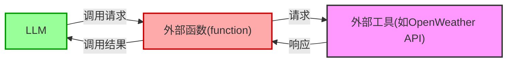
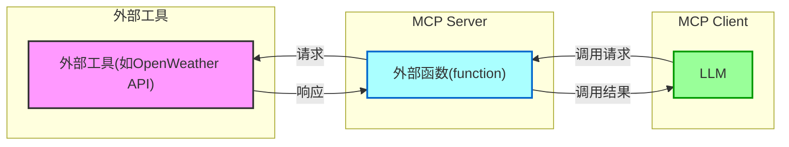

# MCP

- 简单指 Function calling 的能力，能够让 LLM 灵活调用外部工具的能力

## 概念解释

### Server & Client

普通Function calling技术命名




MCP Function calling技术命名



##### Server

##### Client

- LLM 所在的运行环境
- e.g. Cursor, Cherry Studio

#### STDIO

即 standard input and output

```json
"amap-maps": {
	"isActive": true,
    "command": "npx",	// "UVX"
    "args": [
        "y",
        "@ama/amap-maps-mcp-server"
    ],
    "env": {
        "AMAP_MAPS_aPI_KEY": "YOUR_API_KEY"
    },
    "name": "amap-maps"
}
```

本地部署的MCP需要让 MCP server 作为 MCP client 的子进程，让两个进程在一个服务器上运行


# 算子

## Ascend 培训

op_kernel/add_custom.cpp

```cpp
add_custom_do()
    # 函数内修改
    add_custom<<<...>>>
```

progress:

- EnQue (两个输入队列)
- DeQue (一个输入队列)


动态shape

```
即：上传两个文件-->【更新环境文件：init_env.sh，题目样例代码：SigmoidCustom.zip】
执行上述步骤，准备环境。
----------------------------
上传好，在notebook执行下列操作：
1、执行：
bash init_env.sh
更新环境；
2、执行：
source ~/.bashrc
跟新环境变量；
2、执行：
unzip SigmoidCustom.zip -d ./
解压题目文件；
3、执行：
chmod -R 777 SigmoidCustom
chmod -R 777 AclNNInvocation
增加权限；
4、cd进入SigmoidCustom更新补全op_host的sigmoid_custom.cpp、sigmoid_custom_tiling.h题目代码；cd进入op_kernel更新补全sigmoid_custom.cpp题目代码。
```

