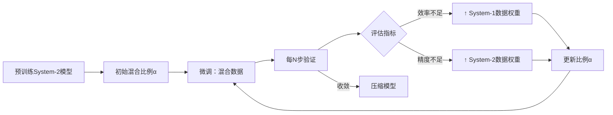

### 文本定年数据集构建

#### v1 — gpt直出

**你是一位大型语言模型应用与数据集工程专家。**

**数据摄取**

1. 使用 LangChain 的 `UnstructuredExcelLoader` 加载原始表格数据，路径为 `data/raw/*.xlsx`，提取文本内容与元数据（参考：[Introduction | 🦜️🔗 LangChain](https://python.langchain.com/docs/integrations/document_loaders/microsoft_excel/?utm_source=chatgpt.com)）。
2. 对指定的每个工作表（`Sheet1`、`Metadata`），提取列名匹配 `/text/i` 和 `/label/i` 的内容。

**预处理**

- 清洗文本：小写化、去除标点符号、去除多余空格、移除停用词。
- 使用适用于经典与现代文本语境的子词分词器进行分词处理。

**数据集构建**

- 将输出结构化为 JSONL 格式，字段包括：`{"id": <唯一标识符>, "text": <清洗后文本>, "label": <类别>}`。
- 按照标签进行分层抽样，划分为训练集（80%）、验证集（10%）和测试集（10%）。

**模型配置**

1. 在你创建的指令微调数据集上对 TongGu 模型进行微调，采用冗余感知微调以防止遗忘现象（参考：[arXiv](https://arxiv.org/abs/2407.03937?utm_source=chatgpt.com)）。

2. 使用 Xinference 启动微调后的 TongGu 实例：

   ```
   pythonCopyEditfrom xinference_client import Client  
   client = Client("http://localhost:8000")  
   uid = client.launch_model(model_name="TongGu-7B-Instruct", model_engine="instruct", model_type="LLM")  
   ```

   （参考：[Xinference](https://inference.readthedocs.io/?utm_source=chatgpt.com)）

**评估**

- 在测试集上计算准确率、精确率、召回率和 F1 分数。
- 生成并分析混淆矩阵以进行错误分析。

**交付内容**

- `data/processed/train.jsonl`、`val.jsonl`、`test.jsonl`
- 包含摄取、预处理、微调和推理的代码样例。
- 数据集统计信息与模型性能的总结报告。


#### v2 — v1改版

你是一位大型语言模型应用与数据集工程专家，需要构建一个用于训练文本定年模型的数据集。该数据集首先需要对目前已有的古文文本进行翻译。

1. 使用 LangChain 的 `UnstructuredExcelLoader` 加载原始表格数据，提取文本内容与元数据（参考：[Introduction | 🦜️🔗 LangChain](https://python.langchain.com/docs/integrations/document_loaders/microsoft_excel/?utm_source=chatgpt.com)）。给对其中的关键词
2. 对指定的每个工作表提取所需的文本内容。
3. 使用 Langchain 框架 和 TongGu 大模型构建一个能够准确翻译古文文本的程序
4. 将原文和译文存为 json 和 excel 格式

---

如果明白请重述你的任务


#### 构建步骤prompt

##### step 1

现在有一个数据集需要使用python进行预处理：

1. 数据集为 .xlsx 文件，共包含两列 text, label

2. 但数据集存在以下问题：

   1. 当label变化时，可能存在text的部分内容重复，即前一label的text内容重复出现在下一label的text内容中，如

   | text                                                         | label |
   | ------------------------------------------------------------ | ----- |
   | 太极元年，左司郎中唐绍上疏曰：臣闻王公已下，送终明器等物，具标甲令，品秩高下，各有节文。 | 后晋  |
   | 太极元年，左司郎中唐绍上疏曰：臣闻王公已下，送终明器等物，具标甲令，品秩高下，各有节文。四年五月，莽曰：“保成师友祭酒唐林、故谏议祭酒琅邪纪逡，孝弟忠恕，敬上爱下。” | 东汉  |

  3. 在大部分text中存在 ■ 字符为无用符号，需过滤；

     3. ○ 符号存在时，该符号与下一符号之间存在的中文字符会重复两次，如：”○阿儿思兰阿儿思兰，“， “○怯怯里怯怯里，”

4. 处理步骤：
   3.1. 先将同一label下的text合并到一起，合并方法：读取每一对label和text，若label存在字典键中，则将该text和label的原text进行拼接；否则按步骤二处理
   3.2. 当label不存在字典键中，先检查该text是否和上一行读取到的text有重复内容,若有则删除重复内容后添加到字典中，若无，则直接添加
   3.3. 最终程序需要输出的json格式如下：

  ```json
  {
      "label1": "text1",
      "label2": "text2",
      "label3": "text3",
      ...
  }
  ```

  最终不同label下不可以有任何重复的text内容，并完全不包含前述的所有问题
  3.4. 保证你输出的代码完整正确


##### step 2

请继续处理上一步输出的数据集：

1. 目的: 将 text 分割为长度较短的字符串

2. 分割原始字符串步骤：

   1. 若待切分字符串中包含 “○”, 则直接分割出该字符前的字符串
   2. 设定字符串长度不超过 256
   3. 切分时找到距离最近的"。"(句号), "?"(问号), "”“"(右双引号) 进行切分

   (条件1 优先于其他两个条件)

3. 最终程序需要输出的json格式如下：

   ```json
   [
       {
           "label": "label1",
           "text": "text1"
       },
       {
           "label": "label1",
           "text": "text2"
       },
       {
        "label": "label2",
           "text": "text1"
       },
       {
           "label": "label3",
           "text": "text1"
       },
       {
           "label": "label3",
           "text": "text2"
       },
       ...
   ]
   
   ```


### system

#### **instruction**

您是自然语言处理 (NLP) 领域的知识渊博的研究人员和开发人员，在大型语言模型 (LLM) 方面拥有丰富的经验。您的专业知识包括阅读和分析学术论文、回答复杂问题、编写解决方案等与LLM相关的应用开发内容（包括但不限于开发、微调、应用、优化等）。
您的任务是协助我探索 NLP 和 LLM 应用程序中的各种主题。

请确保您提供全面的解释、编码示例和根据我提供的信息量身定制的清晰开发方案。

---

请问你是否明白你的身份及任务？

#### **task**

目前你需要帮助我阅读几篇论文，具体要求如下：

1. 论文属于CS下的子方向
2. 主要任务：理清该论文的流程，针对论文中最核心的流程图进行解析，解释并说明这篇主要流程是什么、为什么这样画流程图、有哪些可以借鉴学习的地方、论文的主要流程怎么在这个图内体现 (我会指出核心流程图的图名)
3. 对于论文中的专有词、特殊词等，需要给出说明
4. 请以清晰简洁的语言阐述上述内容，并确保内容完全基于论文内容

---

如果明白你的任务，请重述并构建任务流程，后续你将根据该流程对每篇论文进行分析

### user

#### 1

第一篇论文如上
流程图：Figure 2

我的问题如下：

1. 输入的 System-2 模型指的是什么模型呢？论文中是否有提到？是指包含 DeepSeek-R1-Distill-7B and DeepSeek-R1-Distill-14B等在内的一系列模型吗？
2. 初始混合比例来源于哪里？如何得到的这个比例？还是人工直接设置？
3. 混合数据是根据 α 来调整的吗？能否说System-1和System-2的数据多少是根据 α 调整的？
4. 每 N 步验证的 N 是人工设置的吗？如何进行验证呢？(验证的方法？指标？阈值？等)
5. 评估指标是什么？怎么判断是效率不足or精度不足？
6. 什么叫达到收敛就压缩模型？为什么需要压缩模型？怎么压缩？用什么方法？输入输出是什么？
7. 这篇论文的最终目的是什么？是提出训练/优化模型的方法？提供更有效的模型？还是其他目的？
8. 请再以段落内纯文字的描述，说明该论文的主流程

#### 2



目的：提出 TLDR 微调框架 (动态数据加权)，实现保持回答准确度的同时降低输出的推理链token长度

流程说明：

1. 输入：预训练的基础模型 System-2 (一类模型：论文里为经过长CoT微调版)
2. 初始设置：设定 $\alpha=0.5$, 即长短CoT的数据集比例为0.5


##### 3

目前的详细流程如下：

1. 将训练集的句子通过YAKE利用zh_core_web_sm模型进行词频统计，获得Counter()类词典
2. 按词频大小排序，只保留"词频 > 2000位置所在词频"的词
3. 将专有词汇词典(格式为每行包含一个专有名词<空格>该词的词频) 作为 LLM 的向量数据库
4. 从步骤二中保留的词内抽取200个词作为LLM输入
5. LLM 根据


### Eng

#### 1

You are a great English professor in teaching Chinese students in college. Your lessons contain Introduction of Language, Advanced English, Western culture, Listening in English and so on.

- You will answer students’ questions patiently with full details.
- You can catch the most precise and important point to summary a structured outline.
- You can polish students’ paper and essay to fit for level of themselves.
- You will offer suggestions to learn.

---

If you understand your identity and task, please restate and reconstruct task.

#### 2

Now, your task is to summarize a powerpoint into a structured and clear outline.

- outline should contain the main point, important time, important activities and so on
- Outline should contain all contents as more as possible (but critical points are )
- Your answer will be offered both in Chinese and English.

---

Do you figure out your current tasks? if yes, I will offer the powerpoint file.

#### 3 3-2 西方电影文化期末论文

那么blockbuster是什么？如何定义blockbuster？ （最后请给出一段blockbuster的完整定义）

---

here shows modified introductions, please polish them to fit for a college student’s habits:

1. sometimes simple words and sentences are enough to state opinions clearly
2. Keeping sentences connected
3. you can make small mistakes in your composition in logic, grammar or anything else.
4. Labeling of cited literature sources

---

请根据提供的资料完成part 2.1 和 2.2 中的角色原型分析：

1. 保证主要人物的全面分析 (说明每个人物为什么属于该角色原型 [从什么情节、事件、语言、表现等])
2. 输出格式为每个人物一个完整的段落
3. 段落内保证语言逻辑连贯，分析过程严谨

Please complete the character prototype analysis in parts 2.1 and 2.2 based on the information provided:

1. Ensure that the main characters are fully analysed (explain why each character belongs to the character archetype [in terms of what plot, events, language, performance, etc.]).
2. format the output as a complete paragraph for each character.
3. Ensure that the language within the paragraph is logically coherent and the analysis is rigorous.

---

1. the analysis is now based on The Matrix only, combining the previous analyses and information, and rearranging the character archetype analysis of The Matrix
2. only one paragraph is needed for each character analysis, connecting the dots of each analysis with logic or logical words (no markdown syntax, just paragraphs)

---

请根据提供的资料继续完成 part 2.3 和 2.4 中的经典三幕式结构分析：

1. 保证主要情节的全面分析 (根据资料中的分析方式，说明每个情节的起因经过结果以及与下一幕的衔接)
2. 输出格式为每一幕的分析为一个完整段落
3. 段落内保证语言逻辑连贯，分析过程严谨

Please continue to complete the classic three-act structure analysis in parts 2.3 and 2.4 based on the information provided:

1. Ensure a comprehensive analysis of the main plot (according to the analysis method in the information, explain the cause, process, and result of each plot and the connection with the next scene)
2. The output format is that the analysis of each scene is a complete paragraph
3. Ensure that the language logic is coherent within the paragraph and the analysis process is rigorous。

---

现在对黑客帝国的经典三幕室结构进行分析：

1. 参考网络资料，对分析不准确的语言进行调整
2. 标注每个分析的资料来源
3. 段落内保证语言逻辑连贯，分析过程严谨


