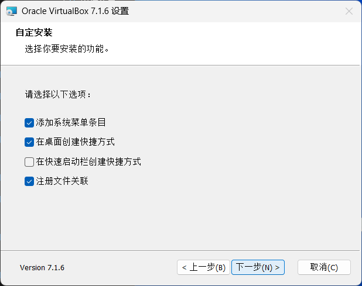
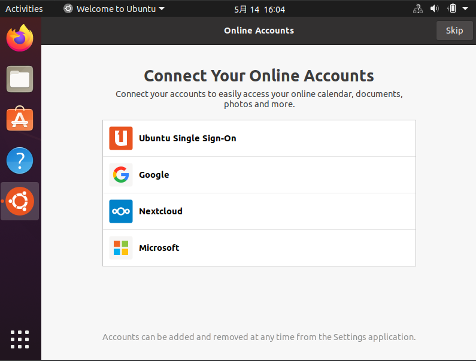
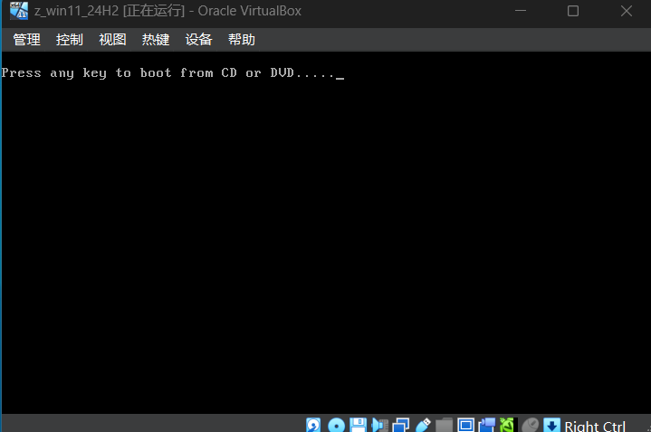
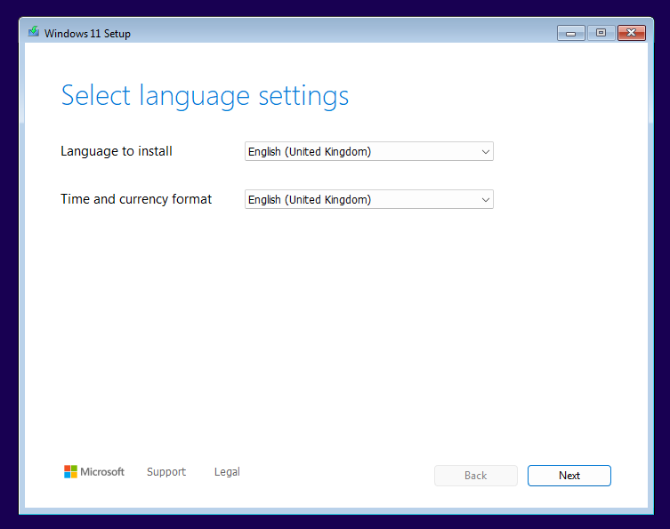

## 1 installation

1. 修改安装目录
   

2. 选择安装功能 (此处全选)
   

3. 提示关闭网络
   

4. 提示缺少依赖: 直接选 **是** 即可
   

5. 选择安装功能
   

6. 确认安装
   

7. 安装中
   

8. 安装完成
   

9. 启动界面
   

   


### error

1. 缺少 C++

2. 无法更换安装目录


### references

> [下载 Windows 虚拟机 - Windows 应用开发 | Microsoft Developer](https://developer.microsoft.com/zh-cn/windows/downloads/virtual-machines/)
>
> ##### VMWare
>
> 貌似可以下载 [VMware Products](https://www.vmware.com/products#t-z)
>
> [安装虚拟机（VMware）保姆级教程（附安装包）_vmware 虚拟机-CSDN 博客](https://blog.csdn.net/weixin_74195551/article/details/127288338)


## 2. Ubuntu

### a. download

官网：

https://ubuntu.com/download/desktop

1.网易镜像：

http://mirrors.163.com/ubuntu-releases/

2.中科大

http://mirrors.ustc.edu.cn/ubuntu-releases/

3.阿里云

http://mirrors.aliyun.com/ubuntu-releases/

4.北理工

http://mirror.bit.edu.cn/ubuntu-releases/

5.浙江大学

http://mirrors.zju.edu.cn/ubuntu-releases/

### b. installation

1. 初始配置界面
   
2. 自定义各项内容如下
   
   
   
   
3. 新建后配置
   
4. 开始安装配置
   
   
5. 选择最小安装方式
   
6. 选择安装类型
   
   - 配置各个分区
     
     
   - 交换空间
     
     
   - 文件系统空间
     
     
   - 配置完成
   - 确认磁盘分区设置
     
7. 设置时区
   
8. 设置用户名等
   
9. 等待安装 (等了一个小时左右)
   
10. 确认重启
    
11. 等待重启
    
12. 普天同庆！终于能用了！
    

### c. configuration

#### 1. 热键

```bash
You have clicked the mouse inside the Virtual Machine display or pressed the host key combo. This will cause the Virtual Machine to capture the host mouse pointer (only if the mouse pointer integration is not currently supported by the guest OS) and the keyboard, which will make them unavailable to other applications running on your host machine.
You can press the host key combo at any time to uncapture the keyboard and mouse (if it is captured) and return them to normal operation. The currently assigned host key combo is shown on the status bar at the bottom of the Virtual Machine window, next to the  icon. This icon, together with the mouse icon placed nearby, indicate the current keyboard and mouse capture state.
```

#### 2. install log

- vim

  ```bash
  %username%@%pc_name%:~/Documents$ sudo apt install vim
  [sudo] password for %username%: 
  Reading package lists... Done
  Building dependency tree       
  Reading state information... Done
  The following additional packages will be installed:
    vim-common vim-runtime vim-tiny
  Suggested packages:
    ctags vim-doc vim-scripts indent
  The following NEW packages will be installed:
    vim vim-runtime
  The following packages will be upgraded:
    vim-common vim-tiny
  2 upgraded, 2 newly installed, 0 to remove and 332 not upgraded.
  Need to get 7,781 kB of archives.
  After this operation, 34.6 MB of additional disk space will be used.
  Do you want to continue? [Y/n] Y
  Get:1 http://mirrors.tuna.tsinghua.edu.cn/ubuntu focal-updates/main amd64 vim-tiny amd64 2:8.1.2269-1ubuntu5.32 [579 kB]
  Get:2 http://mirrors.tuna.tsinghua.edu.cn/ubuntu focal-updates/main amd64 vim-common all 2:8.1.2269-1ubuntu5.32 [84.9 kB]
  Get:3 http://mirrors.tuna.tsinghua.edu.cn/ubuntu focal-updates/main amd64 vim-runtime all 2:8.1.2269-1ubuntu5.32 [5,876 kB]
  Get:4 http://mirrors.tuna.tsinghua.edu.cn/ubuntu focal-updates/main amd64 vim amd64 2:8.1.2269-1ubuntu5.32 [1,241 kB]
  Fetched 7,781 kB in 8s (1,004 kB/s)                                            
  (Reading database ... 157250 files and directories currently installed.)
  Preparing to unpack .../vim-tiny_2%3a8.1.2269-1ubuntu5.32_amd64.deb ...
  Unpacking vim-tiny (2:8.1.2269-1ubuntu5.32) over (2:8.1.2269-1ubuntu5.11) ...
  Preparing to unpack .../vim-common_2%3a8.1.2269-1ubuntu5.32_all.deb ...
  Unpacking vim-common (2:8.1.2269-1ubuntu5.32) over (2:8.1.2269-1ubuntu5.11) ...
  Selecting previously unselected package vim-runtime.
  Preparing to unpack .../vim-runtime_2%3a8.1.2269-1ubuntu5.32_all.deb ...
  Adding 'diversion of /usr/share/vim/vim81/doc/help.txt to /usr/share/vim/vim81/d
  oc/help.txt.vim-tiny by vim-runtime'
  Adding 'diversion of /usr/share/vim/vim81/doc/tags to /usr/share/vim/vim81/doc/t
  ags.vim-tiny by vim-runtime'
  Unpacking vim-runtime (2:8.1.2269-1ubuntu5.32) ...
  Selecting previously unselected package vim.
  Preparing to unpack .../vim_2%3a8.1.2269-1ubuntu5.32_amd64.deb ...
  Unpacking vim (2:8.1.2269-1ubuntu5.32) ...
  Setting up vim-common (2:8.1.2269-1ubuntu5.32) ...
  Setting up vim-runtime (2:8.1.2269-1ubuntu5.32) ...
  Setting up vim (2:8.1.2269-1ubuntu5.32) ...
  update-alternatives: using /usr/bin/vim.basic to provide /usr/bin/vim (vim) in a
  uto mode
  update-alternatives: using /usr/bin/vim.basic to provide /usr/bin/vimdiff (vimdi
  ff) in auto mode
  update-alternatives: using /usr/bin/vim.basic to provide /usr/bin/rvim (rvim) in
   auto mode
  update-alternatives: using /usr/bin/vim.basic to provide /usr/bin/rview (rview) 
  in auto mode
  update-alternatives: using /usr/bin/vim.basic to provide /usr/bin/vi (vi) in aut
  o mode
  update-alternatives: using /usr/bin/vim.basic to provide /usr/bin/view (view) in
   auto mode
  update-alternatives: using /usr/bin/vim.basic to provide /usr/bin/ex (ex) in aut
  o mode
  Setting up vim-tiny (2:8.1.2269-1ubuntu5.32) ...
  Processing triggers for desktop-file-utils (0.24-1ubuntu3) ...
  Processing triggers for mime-support (3.64ubuntu1) ...
  Processing triggers for hicolor-icon-theme (0.17-2) ...
  Processing triggers for gnome-menus (3.36.0-1ubuntu1) ...
  Processing triggers for man-db (2.9.1-1) ...
  
  ```

- git

  ```bash
  %username%@%pc_name%:~/Documents$ sudo apt install git
  Reading package lists... Done
  Building dependency tree       
  Reading state information... Done
  The following additional packages will be installed:
    git-man liberror-perl
  Suggested packages:
    git-daemon-run | git-daemon-sysvinit git-doc git-el git-email git-gui gitk
    gitweb git-cvs git-mediawiki git-svn
  The following NEW packages will be installed:
    git git-man liberror-perl
  0 upgraded, 3 newly installed, 0 to remove and 332 not upgraded.
  Need to get 5,526 kB of archives.
  After this operation, 38.8 MB of additional disk space will be used.
  Do you want to continue? [Y/n] Y
  Get:1 http://mirrors.tuna.tsinghua.edu.cn/ubuntu focal/main amd64 liberror-perl all 0.17029-1 [26.5 kB]
  Get:2 http://mirrors.tuna.tsinghua.edu.cn/ubuntu focal-updates/main amd64 git-man all 1:2.25.1-1ubuntu3.14 [887 kB]
  Get:3 http://mirrors.tuna.tsinghua.edu.cn/ubuntu focal-updates/main amd64 git amd64 1:2.25.1-1ubuntu3.14 [4,613 kB]
  Fetched 5,526 kB in 13s (430 kB/s)                                             
  Selecting previously unselected package liberror-perl.
  (Reading database ... 159086 files and directories currently installed.)
  Preparing to unpack .../liberror-perl_0.17029-1_all.deb ...
  Unpacking liberror-perl (0.17029-1) ...
  Selecting previously unselected package git-man.
  Preparing to unpack .../git-man_1%3a2.25.1-1ubuntu3.14_all.deb ...
  Unpacking git-man (1:2.25.1-1ubuntu3.14) ...
  Selecting previously unselected package git.
  Preparing to unpack .../git_1%3a2.25.1-1ubuntu3.14_amd64.deb ...
  Unpacking git (1:2.25.1-1ubuntu3.14) ...
  Setting up liberror-perl (0.17029-1) ...
  Setting up git-man (1:2.25.1-1ubuntu3.14) ...
  Setting up git (1:2.25.1-1ubuntu3.14) ...
  Processing triggers for man-db (2.9.1-1) ...
  
  ```

#### 3. tools version

- vim

  ```bash
  $ vim --version
  VIM - Vi IMproved 8.1 (2018 May 18, compiled Apr 02 2025 16:39:51)
  ```

- git

  ```bash
  $ git --version
  git version 2.25.1
  ```

#### 4. WeChat / 微信

- 下载安装包

  https://linux.weixin.qq.com/en

  选择 x86 — deb

- Terminal

  ubuntu

  ```bash
  sudo dpkg -i WeChatLinux_x86_64.deb
  ```

  centos, redhat, fedra

  ```bash
  rpm -ivh WeChatLinux_x86_64.rpm
  ```

- reference

  > https://blog.csdn.net/i826056899/article/details/143773019

- log

  2025.05.15
  
  ```bash
%username%@%pc_name%:~$ cd Downloads
  %username%@%pc_name%:~/Downloads$ ls
  WeChatLinux_x86_64.deb
  %username%@%pc_name%:~/Downloads$ sudo dpkg -i WeChatLinux_x86_64.deb
  [sudo] password for %username%: 
  Selecting previously unselected package wechat.
  (Reading database ... 161832 files and directories currently installed.)
  Preparing to unpack WeChatLinux_x86_64.deb ...
  Unpacking wechat (4.0.1.11) ...
  Setting up wechat (4.0.1.11) ...
  Processing triggers for gnome-menus (3.36.0-1ubuntu1) ...
  Processing triggers for desktop-file-utils (0.24-1ubuntu3) ...
  Processing triggers for mime-support (3.64ubuntu1) ...
  Processing triggers for hicolor-icon-theme (0.17-2) ...
  ```
  
  

#### 5. 查看系统架构

```bash
$ uname -m
x86_64

$ lscpu | grep Architecture
```


#### 6. 安装LibreOffice

```bash
sudo apt-get install libreoffice
```


#### 7. 安装增强功能

1. 设备 -> 安装增强功能
2. Run
3. 输入电脑密码
   
4. 开始安装
   
5. 安装完成
   


#### 8. 共享文件夹设置 (Failed)

1. 设备 -> 共享文件夹 -> 共享文件夹, 打开如下界面：
   

2. 添加共享文件夹
   

3. 然后经历一大堆操作，如
   

   并没有什么卵用哈—— 反而还总是把我的剪贴板总是搞没

4. 但现在不知道为啥，能看，但虚拟机这边编辑后无法保存，总是提示 “该文件被占用啥的”


##### reference

> [Gedit不会在VirtualBox共享上保存一个文件:文本文件正忙-腾讯云开发者社区-腾讯云](https://cloud.tencent.com/developer/ask/sof/116646264)
>
> [手把手教你在VirtualBox中与主机共享文件夹_virtualbox共享文件夹在哪-CSDN博客](https://blog.csdn.net/danshiming/article/details/117997558)
>
> 


#### 9. 安装 net-tools

```bash
sudo apt install net-tools
```

**log**

```bash
[sudo] password for %username%: 
Reading package lists... Done
Building dependency tree       
Reading state information... Done
The following NEW packages will be installed
  net-tools
0 to upgrade, 1 to newly install, 0 to remove and 4 not to upgrade.
Need to get 196 kB of archives.
After this operation, 864 kB of additional disk space will be used.
Get:1 http://mirrors.tuna.tsinghua.edu.cn/ubuntu focal/main amd64 net-tools amd64 1.60+git20180626.aebd88e-1ubuntu1 [196 kB]
Fetched 196 kB in 1s (288 kB/s)
Selecting previously unselected package net-tools.
(Reading database ... 172972 files and directories currently installed.)
Preparing to unpack .../net-tools_1.60+git20180626.aebd88e-1ubuntu1_amd64.deb ...
Unpacking net-tools (1.60+git20180626.aebd88e-1ubuntu1) ...
Setting up net-tools (1.60+git20180626.aebd88e-1ubuntu1) ...
Processing triggers for man-db (2.9.1-1) ...
```


#### 10. 首次打开 bash 界面


#### 11. 设置界面显示

视图 :soon: 打开自动调整显示尺寸


### Error

1. vBox 启动虚拟机失败
2. 缺少依赖


### references

> [Ubuntu 最全的国内镜像下载地址_ubutu 全量镜像下载-CSDN 博客](https://blog.csdn.net/Li060703/article/details/106075597)
>
> 安装教程
>[使用 VirtualBox 安装 Ubuntu 详细图文教程](https://blog.csdn.net/Inochigohan/article/details/119791518)
> 
> [在 Windows 中使用 VirtualBox 安装 Ubuntu_厦大实验室](https://dblab.xmu.edu.cn/blog/337/)
>
> [使用 VirtualBox 安装 Ubuntu 系统](https://blog.csdn.net/zsyf33078/article/details/133838203)


## 3. Windows 11

### a. introduction

- iso 下载

  [Windows 11 企业版 | Microsoft Evaluation Center](https://www.microsoft.com/zh-cn/evalcenter/evaluate-windows-11-enterprise)

  本次下载链接

  [下载 Windows 11](https://www.microsoft.com/zh-cn/software-download/windows11)

  iso [文件链接](https://software.download.prss.microsoft.com/dbazure/Win11_24H2_EnglishInternational_x64.iso?t=2dbc2f30-6812-4d0f-bccb-f9c2ce8a2cdc&P1=1747274023&P2=601&P3=2&P4=OTPBoTSAqlQDWeMFWYamdiAjKLiKv0lYpvTQh3ajQiJ6Kxk%2ft0Y7b56Cyea4SWGUhd9Qo5sD2qG7qe5j2d9z5brP3b11QoxKIi60HOonobZWId1tKRh6ztR4JA2b08UW%2bdXXWA9RRTlr60a6RaluL1Stw5tdgd61M423058UJiNpmedMlK2lTVUP5VkGymXEvV%2fQugiilt%2bIIYc6RV2FMdHoV%2bkkpSgcxuST5W%2bG1piS9hkbUsSijDhmVHZ%2fiLZxx8KqJid4H%2fHphLA7Bqt6g1QBNAvYdM5JAcgRuLQ%2fl9dFzUhQbfhOki9Dmje9MzvtyQ4QxlrZJAA8HuDXMGvLsQ%3d%3d)

  1. 页面最低端
  2. 选择安装版本
  3. 获取下载链接
  4. 开始下载 (链接具有时效性，即上述文件链接目前已失效)

- Install log

  1. 2025.05.15：我勒个大考啊，改成 GPT 格式，然后点了几次 format partition，终于能安装了
  2. 2025.05.16：今早终于安装好了，我的天啊，杀了我吧，一堆奇奇怪怪的bug，还搜不到一样的和解决方案，早知道就安装win10了, 真是折磨人


### b. installation

#### 初始新建内容


#### 第一次试装

只分配了 30G，很明显不够，win11至少需要 54G，系统文件就这么多了


那么，因为设置里没找到内存的重新分配，遂删除该虚拟机重建


#### 第二次试装

(其实不一定是第二次，不知道删了多少次虚拟机重建)

1. 激活码：

   - 没有就选 `I don't have a product key`
     

   - 或者按搜到的修改注册表

     打开命令行
     

     输入 `Regedits`, 打开注册表
     

     Computer\HKEY_LOCAL_MACHINE\SYSTEM\Setup\LabConfig 中新建值

     - 如果没有 labconfig 就新建值

     - 有就不管，继续看有没有 DWORD32位 的值

     - 新建 DWORD32位 的以下项，值都设置为 1

       ```powershell
       BypassCPUCheck
       BypassRAMCheck
       BypassSecureBootCheck
       BypassTPMCheck
       BypassStrangeCheck # 貌似有没有不重要
       ```

     - 但不知道为啥，在没点 `I don't have a product key` 之前，就有这些值了，并且这些值都设定为 1，还多一个 `BypassStrangeCheck`

     - 不懂，好崩溃

2. 选择分区装系统
   

3. 选好，Next
   
   OK报错
   

   - 解决方案：无 (因为我也不知道怎么解决的)

   - 搜到的只有修改分区格式，shift + F10 进入 powershell 命令如下

     ```powershell
     diskpart	# 进入磁盘分区
     list disk	# 列出所有磁盘
     select disk 0	# 选中系统盘
     clean		# 格式化全盘
     convert GPT	# 将硬盘转换为 GPT 格式
     exit		# 退出 diskpart
     exit		# 退出 powershell
     ```

   - 亲身试验无效，遂放弃，删虚拟机重装

     > 因为觉得可能是划分的空间太少

   


#### 第三次试装

1. 又是到这步，又说我有问题，然后又执行上面的命令，又能 Next
   
   
2. 安装中 (最期待蓝屏的一次)
   
3. OK，又是奇奇怪怪的bug, 光标一直放不到里面去，一直跳出虚拟机界面外。本次失败，遂继续重装。
   


#### 第四次试装

(其实不一定是第四次，只是我记得的第四次罢了)

1. 不明白这次为啥能选语言设置了 (终于跟教程差不多有这些设置了)
   
   选的带英 :closed_umbrella:
   

2. 选择安装选项
   

3. 突然想起来先设个注册表 (终于没有 LabConfig, 只能让我新建了)
   

4. 选择要安装的版本: 此处选择 win11 专业版
   

5. 认证同意
   

6. 安装准备中
   

7. 系统盘选择
   

   - 太好了，终于弹跟搜到的一样的报错了，解决方案如下：
     

   - 但又有未分配的空间，并且分区奇奇怪怪，遂一顿命令输出

     ```powershell
     # 选磁盘
     select disk 0
     
     # 乱七八糟的分区如下
     partition ###	type		size	offset
     -------------	------		------	-------
     partition 2		reserved	16mb	101mb
     partition 3		primary		79gb	117mb
     
     # 选分区
     select partition 2
     
     # 删分区
     delete partition override
     
     # 格式化磁盘
     clean
     
     # 新建分区
     create partition primary size=81920
     # OK, failed, 一直提示空间不够，我不懂啊服了
     
     # 中间省略一堆乱输的命令
     # 转换磁盘格式
     convert GPT
     convert MBR
     
     # 遂退出
     ```

   - 退出后界面如下
    
   
     - format partition 后再 create partition 也不能创建 80G 的新分区
  - 遂直接用未分配空间，再 Next

8. 准备安装
   

9. 安装中 (老天啊，终于能开始安装)
   

10. 又装
    

11. 继续等
    

12. 进引导了
    

13. 设置电脑名称
    

14. 设置用户名称: %username%
    

15. 设置密码: 
    

16. 设置 3 个安全问题

    - 1
      
    - 2
      
    - 3
      

17. ok, 又开始更新下载，巨慢
    

18. 2025.05.16 早上过来，终于装好了，可惜忘截图了


- references

  > 安装教程
  > [VMware 虚拟机 Windows 10 安装使用教程（非常详细）从零基础入门到精通，看完这一篇就够了-CSDN 博客](https://blog.csdn.net/heike_Ch/article/details/140047605)
  >
  > [虚拟机安装windows11_虚拟机安装win11-CSDN博客](https://blog.csdn.net/qq_45673244/article/details/128703394?utm_medium=distribute.pc_relevant.none-task-blog-2~default~baidujs_baidulandingword~default-1-128703394-blog-131321167.235^v43^pc_blog_bottom_relevance_base9&spm=1001.2101.3001.4242.2&utm_relevant_index=3)
  >
  > [VM VirtualBox虚拟机如何安装WIN11 - 知乎](https://zhuanlan.zhihu.com/p/548015254)
  >
  > [如何用虚拟机VirtualBox安装win11 23H2专业工作站版 - 知乎](https://zhuanlan.zhihu.com/p/672794870)
  >
  > [在虛擬機安裝Windows11系統 | Install Windows11 on VM VirtualBox_virtualboxwin11安装教程-CSDN博客](https://blog.csdn.net/JTnnnnn/article/details/141907414?spm=1001.2101.3001.6650.12&utm_medium=distribute.pc_relevant.none-task-blog-2~default~BlogCommendFromBaidu~Rate-12-141907414-blog-142396401.235^v43^pc_blog_bottom_relevance_base9&depth_1-utm_source=distribute.pc_relevant.none-task-blog-2~default~BlogCommendFromBaidu~Rate-12-141907414-blog-142396401.235^v43^pc_blog_bottom_relevance_base9&utm_relevant_index=17)
  >
  > 
  >
  > Errors
  >
  > [选中的磁盘采用gpt分区形式](https://blog.csdn.net/weixin_31474035/article/details/113411032?spm=1001.2101.3001.6650.13&utm_medium=distribute.pc_relevant.none-task-blog-2~default~BlogCommendFromBaidu~Rate-13-113411032-blog-105645207.235^v43^pc_blog_bottom_relevance_base9&depth_1-utm_source=distribute.pc_relevant.none-task-blog-2~default~BlogCommendFromBaidu~Rate-13-113411032-blog-105645207.235^v43^pc_blog_bottom_relevance_base9&utm_relevant_index=21)
  >
  > [Hyper-V创建Windows虚拟机卡在Press any key to boot from CD or DVD… - 知乎](https://zhuanlan.zhihu.com/p/669623286)
  >
  > 
  
  


## Result

### 2025.05.16

美丽，欣赏。。。。。。


## Error

### 1. 缺少 C++


#### solution

安装包链接 [VC(x64)](https://download.visualstudio.microsoft.com/download/pr/285b28c7-3cf9-47fb-9be8-01cf5323a8df/8F9FB1B3CFE6E5092CF1225ECD6659DAB7CE50B8BF935CB79BFEDE1F3C895240/VC_redist.x64.exe)

安装


references

> package 下载 [最新受支持的 Visual C++ 可再发行程序包下载 | Microsoft Learn](https://learn.microsoft.com/zh-cn/cpp/windows/latest-supported-vc-redist?view=msvc-170)
>
> 参考 [windows11 安装 VirtualBox7，解决报错： needs the Microsoft Visual C++2019 - 知乎](https://zhuanlan.zhihu.com/p/573549446)


### 2. 无法更换安装目录


#### solution

```powershell
icacls D:\VirtualBox /reset /t /c
icacls D:\VirtualBox /inheritance:d /t /c
icacls D:\VirtualBox /grant *S-1-5-32-545:"(OI)(CI)(RX)" /t /c
icacls D:\VirtualBox /deny *S-1-5-32-545:"(DE,WD,AD,WEA,WA)" /t /c
icacls D:\VirtualBox /grant *S-1-5-11:"(OI)(CI)(RX)" /t /c
icacls D:\VirtualBox /deny *S-1-5-11:"(DE,WD,AD,WEA,WA)" /t /c
```

> 已试验 `D:\A_APP\VirtualBox` 安装目录不可行
>

##### output

```powershell
PS C:\Users\%username%> icacls D:\VirtualBox /reset /t /c
已处理的文件: D:\VirtualBox
已成功处理 1 个文件; 处理 0 个文件时失败
PS C:\Users\%username%> icacls D:\VirtualBox /inheritance:d /t /c
已处理的文件: D:\VirtualBox
已成功处理 1 个文件; 处理 0 个文件时失败
PS C:\Users\%username%> icacls D:\VirtualBox /grant *S-1-5-32-545:"(OI)(CI)(RX)" /t /c
已处理的文件: D:\VirtualBox
已成功处理 1 个文件; 处理 0 个文件时失败
PS C:\Users\%username%> icacls D:\VirtualBox /deny *S-1-5-32-545:"(DE,WD,AD,WEA,WA)" /t /c
已处理的文件: D:\VirtualBox
已成功处理 1 个文件; 处理 0 个文件时失败
PS C:\Users\%username%> icacls D:\VirtualBox /grant *S-1-5-11:"(OI)(CI)(RX)" /t /c
已处理的文件: D:\VirtualBox
已成功处理 1 个文件; 处理 0 个文件时失败
PS C:\Users\%username%> icacls D:\VirtualBox /deny *S-1-5-11:"(DE,WD,AD,WEA,WA)" /t /c
已处理的文件: D:\VirtualBox
已成功处理 1 个文件; 处理 0 个文件时失败
```


##### command statement

修改 D:\VirtualBox 目录的访问权限，主要是针对两个用户组进行 授予（grant） 和 拒绝（deny） 权限操作。

- 具体分析

    1. 重置权限
       icacls  "D:\VirtualBox" /reset /t /c

       > reset：重置 D:\VirtualBox 及其所有子目录和文件的权限为默认权限
       >
       > /t：递归应用到所有子文件夹和文件
       >
       > /c：忽略错误并继续执行

    2. 禁用继承
       icacls "D:\VirtualBox" /inheritance: d /t /c

       > inheritance: d：禁用继承并复制当前权限
       >
       > 确保权限不会受到上级目录的影响

    3. 授予“Users”组读取权限
       icacls "D:\VirtualBox" /grant *S-1-5-32-545: "(OI)(CI)(RX)" /t /c

       > *S-1-5-32-545：这是 本地 Users 组（即普通用户）
       >
       > OI（对象继承）：适用于文件
       >
       > CI（容器继承）：适用于文件夹
       >
       > RX（读取和执行）

    4. 拒绝“Users”组的写入、删除和修改权限
       icacls "D:\VirtualBox" /deny *S-1-5-32-545: "(DE, WD, AD, WEA, WA)" /t /c

       > DE（删除）
       >
       > WD（写入数据）
       >
       > AD（追加数据）
       >
       > WEA（写入扩展属性）
       >
       > WA（写入属性）
       >
       > 这样 Users 组只能 读取 文件，无法修改或删除

    5. 授予“Authenticated Users”组读取权限
       icacls "D:\VirtualBox" /grant *S-1-5-11: "(OI)(CI)(RX)" /t /c

       > *S-1-5-11：Authenticated Users 组（所有已登录的用户）
       >
       > (OI)(CI)(RX)：允许读取和执行，但不能修改

    6. 拒绝“Authenticated Users”组的写入、删除和修改权限
       icacls "D:\VirtualBox" /deny *S-1-5-11: "(DE, WD, AD, WEA, WA)" /t /c

       > 阻止 Authenticated Users 组对该目录的修改权限
    
- 总结

    1. Users 组和 Authenticated Users 组 只能 **读取** D:\VirtualBox 目录及其内容，而 无法修改或删除 其中的文件或文件夹。
    2. 禁用了继承，确保权限不会被上级目录影响。
    3. 适用于 Windows 服务器或安全管理环境，用于防止普通用户修改 D:\VirtualBox 目录的内容

##### references

> [VirtualBox7.1.6 安装在 D 盘报错：Invalid installation directory](https://blog.csdn.net/weixin_51966300/article/details/146468769)


### 3. vBox 启动虚拟机失败

原因：应该是安装完 VC++ 后没有重新启动

解决：重启后无报错

> [VBox 启动虚拟机失败 - NtCreateFile-CSDN 博客](https://blog.csdn.net/txwtech/article/details/104412037)


### 4. Ubuntu 缺少依赖

报错：


```bash
An error occurred,please run Package Manager from the right-click menu or apt-get in a terminal to see what is wrong.The error message was: 'Error:BrokenCount>0'This usually means that your installed packages have umnet dependencies
```

原因：应该是安装过程中少了东西

解决：

1. ctrl + alt + T 打开 Terminal

2. 输入

   ```bash
   sudo apt-get upgrade
   sudo apt-get install -f	# or sudo apt-get -f install
   ```

   - 第一次执行  (存在报错)

     ```bash
     %username%@%pc_name%:~$ sudo apt-get upgrade
     	Last modification reported: Thu, 10 Oct 2024 12:55:47 +0000
     E: Unable to fetch some archives, maybe run apt-get update or try with --fix-missing?
     %username%@%pc_name%:~$ sudo apt-get install -f
     Reading package lists... Done
     Building dependency tree       
     Reading state information... Done
     0 upgraded, 0 newly installed, 0 to remove and 332 not upgraded.
     
     ```

   - 第二次执行

     ```bash
     %username%@%pc_name%:~$ sudo apt-get upgrade
     ... # 省略 n 行
     0 added, 0 removed; done.
     Running hooks in /etc/ca-certificates/update.d...
     done.
     Processing triggers for libgdk-pixbuf2.0-0:amd64 (2.40.0+dfsg-3ubuntu0.5) ...
     %username%@%pc_name%:~$ sudo apt-get install -f
     Reading package lists... Done
     Building dependency tree       
     Reading state information... Done
     0 upgraded, 0 newly installed, 0 to remove and 4 not upgraded.
     ```

   - 反正不报错了
   
3. references

   > [Ubuntu 报错 please run Package Manager from the right-click menu or apt-get in a terminal to see-CSDN 博客](https://blog.csdn.net/u012011079/article/details/127484788)


### 5. Ubuntu安装开始选择

一般如果遇到以下界面，选择 Try or Install Ubuntu 或 Ubunru (safe graphics)

- 本次选择 Try or Install Ubuntu


> [【Ubuntu 安装选项】_try or install ubuntu-CSDN 博客](https://blog.csdn.net/weixin_48345177/article/details/130123955)


### 6. 高版本Ubuntu无法安装

1. 刚开始下载的 25 版本无法在本机 DG 上安装，如上个问题所示，最后无法安装，点 show log 后，啥也没出现，好像只有黑屏
2. 只能换成了目前的 **`20.04.06`** 版本


# Bottom
